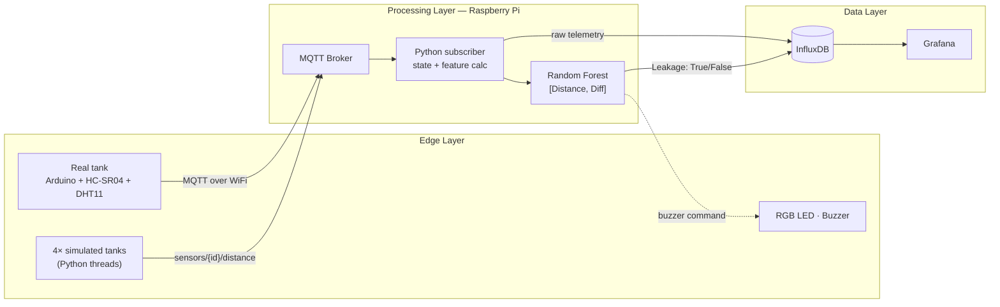

# 💧 Real-Time Water Leakage Detection
### A multi-tiered IoT architecture with edge Machine Learning


> An end-to-end IoT/CPS pipeline that detects water leaks in industrial tanks **in real time**, running ML inference **directly on a Raspberry Pi** (< 1 ms per prediction) with no cloud dependency. From sensor to dashboard: Arduino → MQTT → Random Forest → InfluxDB → Grafana.


📄 **Paper:** *Real-Time Water Leakage Detection: A Multi-Tiered IoT Architecture using Machine Learning* — Faculdade de Engenharia da Universidade do Porto (FEUP)

---

## 🎯 The problem

Industrial water treatment facilities rely on distributed tanks that are still often monitored by manual inspection: slow, error-prone and impossible to scale. Undetected leaks mean wasted water, higher costs and safety risks.

Simple **threshold-based** systems can't tell a *tank that is low but stable* from a *tank that is actively leaking*. This project solves that by looking at **how the level changes over time**, not only at where it is.

## ✨ Key features

- **Edge inference** — Random Forest running on a Raspberry Pi, **< 1 ms** per prediction, works without internet connectivity.
- **Differential feature engineering** — the rate of change `Diff = dₜ − dₜ₋₁` between consecutive readings separates active leaks from static low levels.
- **Real hardware + simulation** — 4 simulated tanks and 1 physical proof-of-concept tank (HC-SR04 sonar + DHT11 temperature sensor).
- **Multi-threaded sensor simulator** — a 3-state machine (`STABLE` / `LEAKING` / `REFILLING`) with Gaussian noise, letting the software stack be developed and tested independently of the hardware.
- **Hybrid alerting** — autonomous local RGB LED (works offline) + ML-controlled buzzer commanded over MQTT.
- **Scalable dashboard** — one Grafana dashboard for N tanks through a `process_id` variable, with a digital twin panel, live telemetry and a leak history timeline.
- **Robustness fallback** — an alternative threshold-based model for the physical setup, where sonar jitter mimicked leak rates.

## 🏗️ Architecture




| Layer | Component | Role |
|---|---|---|
| **Edge** | Arduino, HC-SR04 sonar, DHT11, RGB LED, buzzer | Sensing, local alert, WiFi + MQTT publishing |
| **Processing** | Raspberry Pi (Mosquitto + Python + scikit-learn) | Ingestion, state management, real-time inference |
| **Data** | InfluxDB + Grafana | Time-series storage, visualization, historical analysis |

MQTT topics follow the structure `sensors/{process_id}/{measurement}`; the controller subscribes to `sensors/+/distance` and keeps an in-memory state per tank to compute `Diff` correctly for every incoming packet.

## 🧠 Machine Learning

| | |
|---|---|
| **Model** | Random Forest Classifier (scikit-learn), serialized with `joblib` |
| **Features** | `Distance` (sensor → water surface), `Diff` (rate of change) |
| **Training data** | 15,000 synthetic samples, 50 episodes, randomized leak rates and timings |
| **Phases modeled** | Stable Full, Active Leaking, Stable Empty |
| **Output** | Boolean `Leakage` flag, written to InfluxDB with the raw metrics |

Water level shown on the dashboard is computed as:

```
Level% = (H_bucket − D_sensor) / H_bucket × 100
```

### Results

| Class | Precision | Recall | F1-Score |
|---|---|---|---|
| Stable (No Leak) | 0.99 | 1.00 | 0.99 |
| Leakage Detected | 1.00 | 0.98 | 0.99 |

- ⚡ Inference latency: **< 1 ms**
- 📡 Throughput: ~**5 Hz per sensor node** processed on the Raspberry Pi
- 🖥️ Bottleneck: Grafana refresh rate (~0.2 Hz), not the pipeline

> ⚠️ **Honest note:** the 99% F1 is measured on **synthetic data**, which is expected to be easy. Real-world validation is discussed below.

## 🔬 From simulation to hardware: what I learned

On the physical proof of concept, the HC-SR04 showed **signal jitter** near the water surface that occasionally looked like a real leak rate, producing false positives for the rate-based model.

To fix this, I developed a **threshold-based fallback model** that prioritizes absolute water level over rate of change. It is theoretically less sophisticated (it detects level depletion rather than active flow) but proved **significantly more stable** on real hardware, while the rate-based model stayed superior in simulation for sudden, small-scale leaks.

**Takeaway:** the best model in simulation is not necessarily the best model on real sensors. Noise handling and the sim-to-real gap matter as much as the algorithm.

## 📊 Dashboard

The Grafana interface is organized in three sections:

1. **System Alerts & Digital Twin** — timestamp, a binary alarm (`SYSTEM SECURE` ↔ flashing `CRITICAL LEAK`) and a canvas-based digital twin of the tank.
2. **Tank Telemetry** — water level time series, bar gauge for fill level, arc gauge for temperature (°C).
3. **Historical Analysis** — state timeline of `OK` / `LEAK` events to assess frequency and duration.

A `process_id` dropdown switches between tanks without duplicating panels.

<!--


-->

## 🚀 Getting started

```bash
# 1. Clone
git clone https://github.com/mpozz28/Water-Leakage_Detection-IoT.git

# 2. Install dependencies
pip install -r requirements.txt

# 3. Start the MQTT broker, InfluxDB and Grafana on the Raspberry Pi
#    (or locally for testing)

# 4. Train the model on synthetic data
python train_model.py

# 5. Start the controller (subscribes to sensors/+/distance)
python controller.py

# 6. Start the sensor simulator
python simulator.py
```

For the physical node, flash the Arduino sketch, set your WiFi credentials and broker address, then wire the HC-SR04, DHT11, RGB LED and buzzer as documented in the paper.

## 🗂️ Repository structure

```
├── arduino/          # Edge node firmware (sensors, WiFi, MQTT, LED/buzzer)
├── simulator/        # Multi-threaded sensor simulator (STABLE/LEAKING/REFILLING)
├── ml/               # Data generation, training, evaluation, saved model
├── controller/       # MQTT subscriber, state management, inference, InfluxDB writer
├── grafana/          # Dashboard JSON export
├── docs/             # Paper, diagrams, screenshots
└── README.md
```

## ⚠️ Limitations & future work

**Current limitations**
- Model trained on synthetic data only; generalization to varying tank geometries and multi-event scenarios is unproven.
- Ultrasonic sensor noise required a threshold-based fallback for the physical setup.
- No leak localization or predictive maintenance; actuation limited to local alerts (LED/buzzer).
- Grafana refresh limited to ~0.2 Hz.

**Planned improvements**
- Noise mitigation (Kalman filtering, sensor fusion with flow/moisture sensors).
- Retraining and benchmarking on real datasets such as [LeakDB](https://github.com/KIOS-Research/LeakDB).
- Lightweight CNNs / TinyML for on-device inference on the microcontroller.
- Leak localization, automated valve control, LoRaWAN for long-range deployments.
- Security hardening (device tampering, broker vulnerabilities).

## 🛠️ Skills demonstrated

`IoT architecture` · `Embedded C/C++ (Arduino)` · `Python` · `MQTT pub/sub` · `Edge computing` · `Machine Learning (scikit-learn)` · `Feature engineering` · `Time-series databases (InfluxDB)` · `Data visualization (Grafana)` · `Multi-threaded simulation` · `Sim-to-real validation` · `Team collaboration with parallel workstreams`

